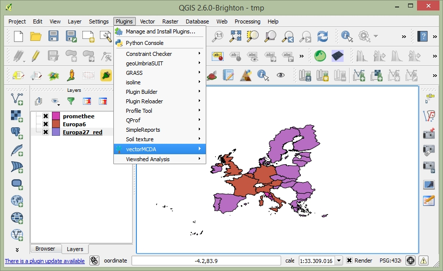
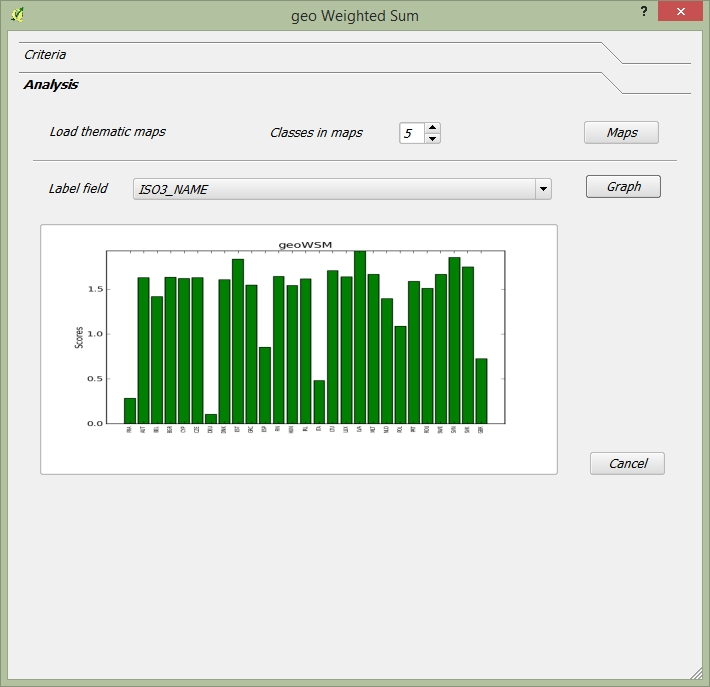
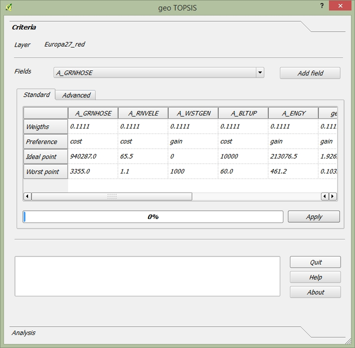
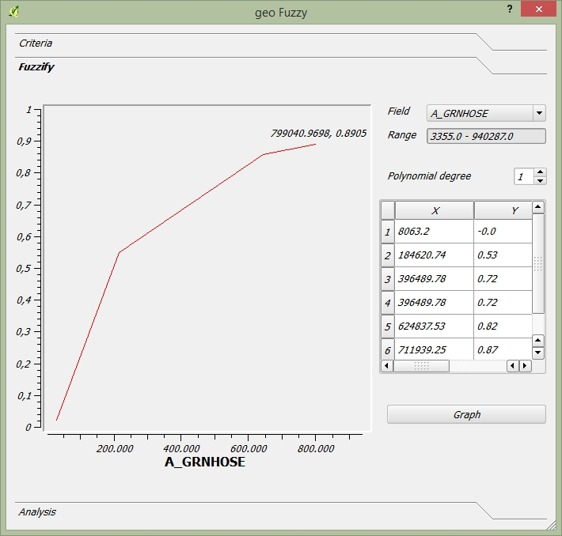
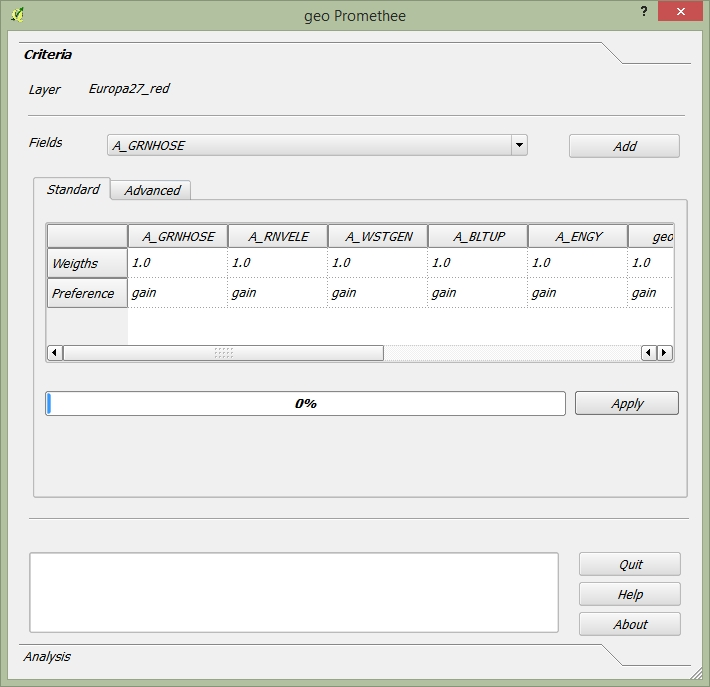
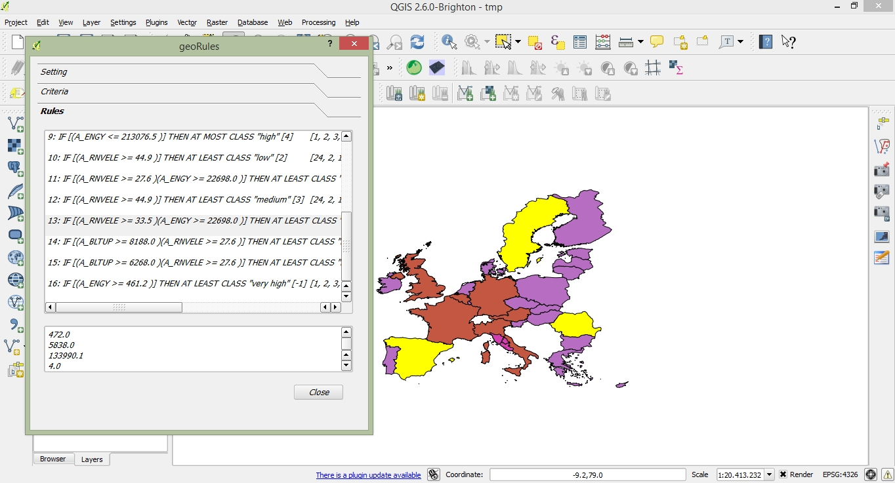

.. VectorMCDA documentation master file, created by
   sphinx-quickstart on Fri Jan 23 20:24:10 2015.
   You can adapt this file completely to your liking, but it should at least
   contain the root `toctree` directive.

Welcome to VectorMCDA's documentation!
======================================

	
Description of VectorMCDA 
----------------------------

**VectorMCDA** implements some multicriteria decision aid (**MCDA**) algorithms using vector data in QGIS GFOSS software. 
VectorMCDA assumes that each geographical object, described with a record in the attribute table, is a single 
alternative (**geo-alternative**). Each algorithm  implemented in the plugin analyzes and elaborates the attributes as criteria; 
then it returns as an output the preference indices, adding in the attribute table one or more columns. 
Such an output are shown also as geographic maps in QGIS canvas and in a graphical html page.
The algorithms available in the current VectorMCDA version are the follow:

**geoWeightedSum**: [1] implements the classic **weighted sum algorithm** and returns a maps shown the preference granted to the various geo-alternatives. 
The user may provide directly the weight values, or she can calculate them with  AHP [2] approach implemented in the module.

**geoTOPSIS**: implements the **ideal point algorithms** based on TOPSIS model [3] and returns a map shown the ranking  
alternatives in a colored and numerical scale and also in a graph in a html page. Even in this case, the user may provide  
the weight values directly, or she can calculate them with AHP [2] procedure implemented in the module.
 
**geoFuzzy**: implements the **fuzzy MCDA model** proposed by **Yager** [4]. It returns the fuzzy intersection and fuzzy union MCDA indices. 
The **linguistic modifier** may be provided in the same way of weights, seen in the previous algorithms.

**geoConcordance**: calculates the concordance and discordance index for each geo-alternative, as a base for assessing with **Electre** [5] models family. 
The module returns two maps, one for concordance index and one for discordance index. The weighing phase is the same seen in the previous algorithms. 
 
**geoPromethee**: implements the **Promethee** [6] method in a geographic way. The outputs are the negative and the positive flux for each alternatives, 
while the net one can be calculated using a gis function. All the outputs are produced in maps and graphs in html separate page. 
The values are stored in the attribute table. The weighing step is the same seen in the previous algorithms.

**geoRSDB**: the module implements the **DOMLEM** algorithm for **Dominance- based Rough Set Approach(DRSA)**[7]. 
The output is a set of **decisional rules** extracted from a pre-definited ranking, stored in the attributes table. 
The module doesn't make a classification of geo-alternatives, but pick up the rules from the attributes table, 
which includes a column with ranking value. Therefore, the current implementation of the module is "discovery  knowledge oriented", 
instead of a proper MCDA algorithm. In future development, the rules extracted will be used for performing a real MCDA classification.
 
**geoXMCDA**: is the first implementation in QGIS of xMCDA standard (http://www.decision-deck.org/xmcda/) for granting the MCDA data interoperability. 
The module is not yet mature and it is not usable for proper application; anyway it is under active development and testing phase. 

Installation
++++++++++++

The plugin works under QGIS >=2.0 environment. The first time the user need to follow the installation procedure:

1. from the menu **Plugins** choose  **Manage and Install plugin**,  the **Plugin manager** window will open;

2. if VectorMCDA is already installed, you will find it under the **installed** plugins in **Plugin manager**. 
Otherwise, the plugin will be listed under **Get more** and you can install it by clicking on **Install plugin**. 
Check to pick the option "include sperimental plugins" before.

3. after the end of installation procedure, VectorMCDA will be accessible from the menu **Plugins**;

     Figure 1: Plugin manager in QGIS

VectorMCDA implements several MCDA algorithms, available for the users at menu shown in Figure 1.

The user can download example data from the site http://maplab.alwaysdata.net/geomcda.html.

Outputs
+++++++

Although there are specific approach for each algorithms implemented,
the page **Analysis** allows the user to get the outputs provided from the each plugin, which are mainly two: 

1. **cartographic:** pressing the **Load maps** button, the user can load the output thematic map based on the canvas showing the ranking of geo-alternatives in  choropleth map.

2. **graphic:**  the user has to select the field used for labelling the geo-alternatives from the combo-box **Label field**. Pressing the **Graph** button, 
VectorMCDA will load an html page in a web browser with a histogram  proportional with the performance of each geo-alternatives.

Running geoWeightedSum
+++++++++++++++++++++

The user has to load a vector geographic data in QGIS and select it by clicking with the mouse over the name. 
The attributes table of the vector file has to contain the indicators the user intends to use in the assessment 
and a label for identifying the geo-alternatives. 
From the menu **Plugins/VectorMCDA** we can select **geoWeightedSum** and the window shown in Figure 2 will open.

In the **Criteria** page the label **Layer** shows the active layer's name, while the combo-box **field** holds the 
list of numerical fields in the attributes table. The **Add field** button inserts the selected field in the combo-box 
as a new column in the **table**, as a new criterion used in MCDA analysis. 
The columns in the table included in the card **Standard** holds all the numerical fields from the attributes table 
of the selected layer, used for the MCDA analysis, meaning as criteria. The first row of the table contains the weight 
for each criterion (column), while the second row shows the preference function as cost or gain.
The user has to decide which criterion she wants to use for the analysis. The ones she does not want to use have to be 
selected on the table (clicking with the mouse on the header) and removed through the menu activated with the right button of the mouse. 
User can add a field in the analysis using the **Add field** button on the card. 
The next step is the weighting phase. The user can write directly the weight of each criterion in the first row; 
otherwise it is available the AHP procedure with a pairwise comparison matrix, in the **Advance** card. 
To use the AHP weighting procedure, the user has to compare the criteria present in the rows with the ones present in the columns, 
and types the preferences in a range [1/9....9/1]. The weight are calculated with the **Calculate weight** button and the values are 
inserted automatically in the table of **Standard** card. Then, the user has to define the preference function for each criterion;
 if a criterion is preferable in case of an increasing value, the value of the preference to be selected is **gain**, 
 otherwise the selected value has to be **cost**. 

.. figure:: ./_images/geoWeightedSum.jpg
     :height: 500	
     :align: center
     
     **Figure 2.a:** geoWeightedSum algorithm in VectorMCDA plugin. Criteria Tab.

Pressing the button **Apply** the user performs the analysis, and the plugin generates on the attribute table a new field named **geoWSM** 
that holds the values of each alternative  (each row in the table of attribute, and each relative geographic object).

With the **Analysis** the user can see the graphical and geographical outputs.  The **Maps** button load the map in QGIS, with the colors graduated  
with **geoWSM** field.  The **Graph** button open a html page with bar-graph labeled with **Label filed** in the combo-box
	 

     **Figure 2.b:** geoWeightedSum algorithm in VectorMCDA plugin. Analysis Tab.

	 

Running geoTOPSIS
+++++++++++++++++++++

The **geoTOPSIS** module can be lunched from **Plugins/VectorMCDA/geoTOPSIS**, which open the window for perform geoTOPSIS MCDA analysis.
The general inputs are the same seen in the geoWeightedSum. The table in the **Standard** page has the same field and meaning of the previous module, 
except for the last two rows: **ideal point** and **worst point**. 
The **Ideal point** is the target and optimum value to be reached by each criterion. The default value is the best one present in the attribute table 
for each single criterion. The **worst point** is the opposite of the ideal point and the default value is the worse in the attributes table. 
The user may change both the values with a different one, according to analysis’ needs. 
The **Load maps** and **Graph** buttons are described in geoWeightedSum and have the same meaning and behavior.

     **Figure 3:** geoTOPSIS algorithm in VectorMCDA plugin. 

Running geoFuzzy
+++++++++++++++++++++

Comparing to the previous plugins, **geoFuzzy* differs for an additional label (**"Hedges" **) on the first row of the card "Standard". 
The label "Hedges" identifies the linguistic modifier of the Yager model, implemented in the plugin.

.. figure:: ./_images/geoFuzzy.jpg
     :height: 500
     :align: center

     **Figure 4:** geoFuzzy algorithm in VectorMCDA plugin. Criteria tab.

The other four fields(“first”, “second”, “third”, ”fourth”) are typical of the gaussian fuzzy function and they can have a value 
between 0 (colored in orange) and 1 (colored in red). The default value is calculated as a growing and linear function, 
using as minimum value the minimum value in the table for each criterion and as maximum the maximum one in the table.  
The user can change both the min and max of the function and the value 0/1, calculated by the plugin. Therefore, for each criterion 
is calculated a fuzzy function, and the plugin add two new field in the table: **geoFzyAND** and **geoFzOR**. 
The former represents the results of the AND logic operator (intersection), the latter represents the OR logic operator (union).
	 

     **Figure 5:** geoFuzzy algorithm in VectorMCDA plugin. Fuzzify tab.

Using the button "load maps" on the card "Analysis" two qgis maps are displayed, showing the union and intersection index.

Running geoConcordance
+++++++++++++++++++++

The **geoConcordance** module can be lunched from **Plugins/VectorMCDA/geoConcordance**, which open the window for 
perform geoConcordance MCDA analysis.

     **Figure 6:** geoConcordance algorithm in VectorMCDA plugin. 

The geoConcordance module does not have specific commands for running the analysis. Pressing the button Apply 
the user performs the analysis and generates two new fields in the attributes table. **geoConc** which represents 
the concordance index and **geoDisc** which represents the discordance ones. Using the two indices and functions 
already present in QGIS, user can perform more detailed analysis according to the Electre family methods. 

Running geoPromethee
+++++++++++++++++++++

The basic command for running **geoPromethee* has been already described in the previous paragraphs.

     **Figure 7:** geoPromethee algorithm in VectorMCDA plugin. 

Applying the analysis, the module produces two new field in the attributes table: **geoFlu[+]** and **geoFlu[-]**, 
which represents the positive and negative flux of the Promethee method. 
The Net flux can be easily calculated using the QGIS functions. 
	 
Running geoRULES
+++++++++++++++++++++

This plugin is both an instrument of analysis and comprehension of a choice already done, and is a tool for 
produce a ranking of alternatives, thanks to the Dominance-Based Rough Set Approach (DRSA)

     **Figure 8:** geoRULES algorithm in VectorMCDA plugin. 

To access to **geoRULES** open the menu: Plugins/VectoMCDA/geoRSDB. It is required as an input an already performed valuation of alternatives. 
In the combobox **”Decision file”** the user has to select the field which includes the decision values. By pushing the **“Extract rules”** button 
(in the bottom part of the card) the modules produces, as an output, a text contains the **"decision rules"**. The single rules have the following 
syntax: “ 
**IF     A>= (or <=)  X   THEN   AT   LEAST   i-esima** 
which mean: “if the criterion A is equal or bigger (or lower) than x, then it is at least (at most) in the i-esima class”. By clicking on each single rule, 
all the units which support such a rule will be highlighted in yellow. At the same time, on the QGIS map will be shown all the geographical areas which support 
such a rules. The plugin is very useful to understand, for instance, which criteria is the most important for obtaining a certain ranking or if the Decision 
Maker gives a weight too big to a single criterion. Moreover, the plugin contributes to improve the knowledge about the decision process, because the decision 
rules analysis may be use to communicate the results in a stronger way. 
The user can apply the rules extracted to the overall map, for a conplete reclassification of geographic alternatives, even if the rules are extracted with a subset of examples (maps object). 
In this case, the checkbox "use selected features only"  in the **”Setting”** card has to be selected. With the button **"Applay rules to maps"**, geoRULES shows the maps with **AT LEAST** or 
**AT MOST** rules, ranked in five different classes (very low, low, medium, higt, very higt).
In case of decision rules with a continuous numeric domain, “geoRULES” is very useful to discrete it. Even this process could be done using the **”Setting”** card, 
which adds a new field named **”Classified”**. This stage it is not mandatory for the analysis. 

Running geoXMCDA
+++++++++++++++++++++

The **geoXMCDA** is not a multicriteria plugin. Its aim is to simplify the interchange of vectorial data, according to the approach proposed by the 
Decision   Deck   project   (http://www.decision-deck.org/project/index.html). The development of the plugin is still ongoing.

.. figure:: ./_images/geoXMCDA.jpg
     :height: 500
     :align: center

     **Figure 9:** geoXMCDA algorithm in VectorMCDA plugin. 

Outputs
+++++++

The page **Analysis** [figure 4] allows the user to get the outputs provided from the plugin. Although there are specific approach for each algorithms implemented,
you can have two outputs:

1. **cartographic:** pressing the **Load maps** button, the user can load the output thematic map based on the canvas showing the ranking of geo-alternatives in  choropleth map.

2. **graphic:**  the user has to select the field used for labelling the geo-alternatives from the combo-box **Label field**. Pressing the **Graph** button, 
VectorMCDA will load an html page in a web browser with a histogram  proportional with the performance of each geo-alternatives.

Bibliography
------------
[1] Triantaphyllou, E. (2000). Multi-Criteria Decision Making: A Comparative Study. Dordrecht, The Netherlands: Kluwer Academic Publishers (now Springer). p. 320. ISBN 0-7923-6607-7. 

[2] Thomas L. Saaty, Decision Making for Leaders – The Analytic Hierarchy Process for Decisions in a Complex World, RWS Publishing, Pittsburgh, 1990. 

[3] Hwang, C.L.; Yoon, K. (1981). Multiple Attribute Decision Making: Methods and Applications. New York: Springer-Verlag. 

[4] Yager, R.R., 1978, Fuzzy decision making including unequal objectives, Fuzzy Sets and Systems, 1:  (1978) 87-95.

[5] Roy B., (1991), “The outranking approach and the foundation of ELECTRE methods, Theory an Decision, vol. 31, 49-73.

[6] J.P. Brans and P. Vincke (1985). "A preference ranking organisation method: The PROMETHEE method for MCDM". Management Science. 

[7] Greco, S., Matarazzo, B., Slowinski, R.: Rough sets theory for multi-criteria decision analysis. European Journal of Operational Research, 129, 1 (2001) 

	 
* :ref:`genindex`
* :ref:`modindex`
* :ref:`search`

. 
